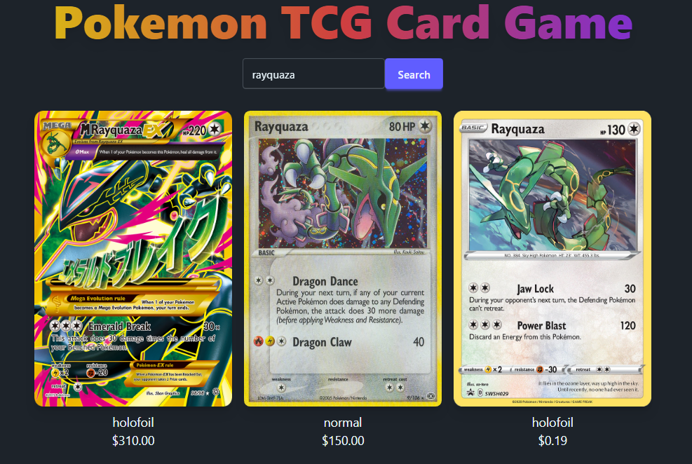

# PokeTCG-Guesser


## Game Description

PokeApp is a Pokémon TCG card guessing game. The app fetches real Pokémon Trading Card Game data using the [Pokémon TCG API](https://docs.pokemontcg.io/).

**How to Play:**
- You are shown a random Pokémon card (or a selection to choose from), but the card's name and image are blurred out.
- Try to guess the Pokémon! With each incorrect guess, more letters of the name are revealed or the image becomes less blurred.
- You have a total of 5 tries to guess correctly.

**Future Game Modes:**
- High/Low: Guess if the next card's price is higher or lower.
- Guess the price of a card.
- Guess the rarity, type, or set of a card.

> **Note:** This application is for educational and portfolio project purposes ONLY.


This project was generated using [Angular CLI](https://github.com/angular/angular-cli) version 19.2.8.

## Development server

To start a local development server, run:

```bash
ng serve
```

Once the server is running, open your browser and navigate to `http://localhost:4200/`. The application will automatically reload whenever you modify any of the source files.


## Building

To build the project run:

```bash
ng build
```

This will compile your project and store the build artifacts in the `dist/` directory. By default, the production build optimizes your application for performance and speed.


## Current Status
Currently I only have the below done. Gets 3 random cards given pokemon name and outputs price
